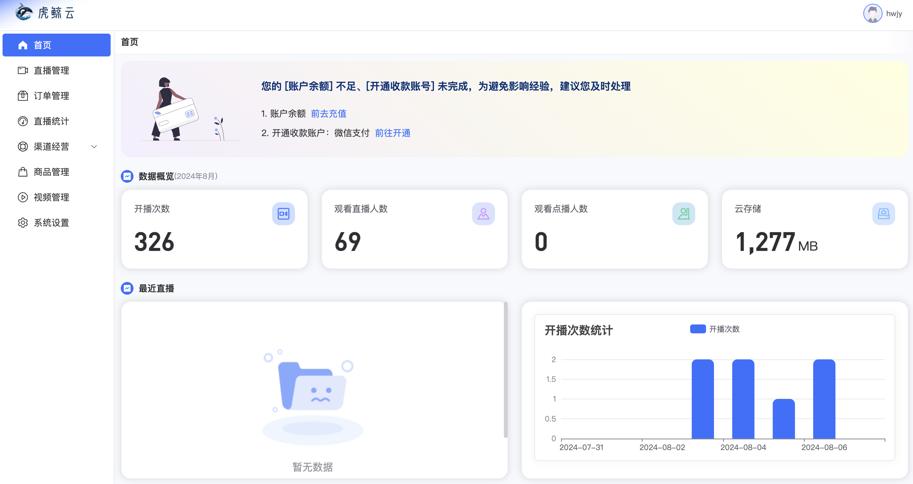

# 虎鲸云 直播运营管理端

## AD 欢迎大佬们关注公众号 pinkhello 与 🌍 

- 公众号
    
    

- 个人🌍 
    
    

## 项目介绍
 
 > 专注提供私域直播的开源的SAAS解决方案。
 
## 项目组成

- [运营管理端](https://github.com/orca-yun/orca-admin)

- [直播助播端](https://github.com/orca-yun/assis-client)

- [直播主播端](https://github.com/orca-yun/anchor-client)

- [直播观看端](https://github.com/orca-yun/audience-client)

- [直播后端服务](https://github.com/orca-yun/living)

- [基础服务-视频直播](联系+V: pink-hello 索取)

- [基础服务-白板服务](联系+V: pink-hello 索取)

- [基础服务-动弹服务](联系+V: pink-hello 索取)

## Demo 地址
- https://admin.orcacl.com  hwjy/hwjy123

## 项目功能 🔨

虎鲸云直播运营管理端

- 直播管理
- 直播开播
- 直播分享
- 直播数据
- 渠道管理
- 渠道数据
- 订单管理
- 商品管理
- 系统设置
- 礼物配置
- 免审词库
- 敏感词库
- 支付等

# 界面展示

 

 
 

### 开发指南 & 项目目录介绍

- [开发指南](./README.DEV.md)
